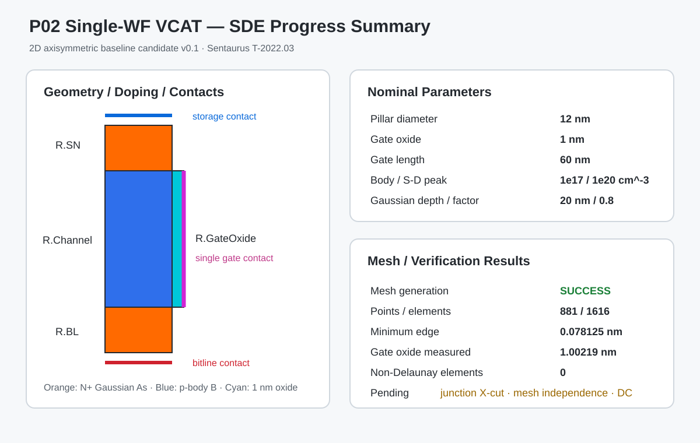

# Phase 2 Single-Metal VCAT — Baseline Progress

## 목적

다중 일함수 VCAT 후보 구조와 비교하기 위한 Single-Work-Function VCAT 기준 구조를 구현하고, 구조·접촉·도핑·메시·DC 특성을 단계적으로 검증한다.

## 현재 상태

- 2D axisymmetric cylindrical VCAT 구조 생성 성공
- Single continuous gate contact 구현
- Storage / Bitline / Gate contact 확인
- Gaussian 형태의 상·하부 S/D 도핑 전이 확인
- Si/SiO2 계면 및 접합부 국부 메시 적용
- SDE 및 Sentaurus Mesh 실행 성공
- 분리형 SDevice 노드에서 `VdBias=0.05 V`, `1.0 V` Id–Vg 수렴 확인
- Id–Vd 및 DC 지표 추출은 진행 예정

## 진행 요약 그림

## 기준 조건

| 항목 | 값 |
|---|---:|
| Pillar diameter | 12 nm |
| Gate oxide thickness | 1 nm |
| Gate length | 60 nm |
| Storage-side silicon length | 20 nm |
| Bitline-side silicon length | 20 nm |
| Body doping | 1e17 cm^-3, Boron |
| S/D peak doping | 1e20 cm^-3, Arsenic |
| SN Gaussian depth | 20 nm |
| BL Gaussian depth | 20 nm |
| Gaussian factor | 0.8 |
| Gate work function | 4.70 eV |
| Temperature | 300 K |
| MeshScale | 1.0 |

## 구조 및 접촉

### Regions
- `R.SN`
- `R.Channel`
- `R.BL`
- `R.GateOxide`

### Contacts
- `storage`
- `bitline`
- `gate`

## 메시 결과

- 881 points
- 1616 elements
- Minimum edge length: `7.8125e-05 um` = `0.078125 nm`
- Minimum angle: `1.71836 deg`
- Non-Delaunay elements: 0
- Measured gate oxide thickness: `1.00219 nm`

## 업로드 파일

### Code
- `code/P02_SWF_VCAT_SDE_v0p1.cmd`
- `code/P02_SWF_SDevice_IdVg_v0p2.cmd`

### Tables
- `tables/P02_SWB_Parameters.csv`
- `tables/P02_SWF_Coordinates_Units_Variables.csv`
- `tables/P02_SWF_Contact_Region_Summary.csv`
- `tables/P02_SWF_Mesh_Settings.csv`

### Figures
- `figures/P02_SWF_SDE_Summary.svg`

### Notes
- `notes/P02_SWF_Mesh_Run_Summary.md`
- `notes/P02_SWF_Current_Status.md`
- `notes/P02_SWF_Output_Mapping.md`

## 체크 상태

- 완료: `P02-T01`, `P02-T02`, `P02-T03`, `P02-T05`
- 진행 중: `P02-T04`, `P02-T06`
- 미진행: `P02-T07`, `P02-T08`, `P02-T09`

## 현재 한계

- Metallurgical junction 위치의 donor/acceptor X-cut 정량 추출 미완료
- Id–Vd 미실행
- Vth, SS, Ion, Ioff, DIBL 결과표 미완료
- Mesh independence 미완료
- 아직 `shared/` 기준 코드가 아닌 개인 작업 결과

## 다음 작업

1. Donor / Acceptor concentration X-cut으로 접합 위치 측정
2. Id–Vd 계산
3. Vth, SS, Ion, Ioff, DIBL 추출
4. 양방향 전류 검증
5. GIDL 및 전계 분포 검증
6. Coarse / Medium / Fine mesh independence
